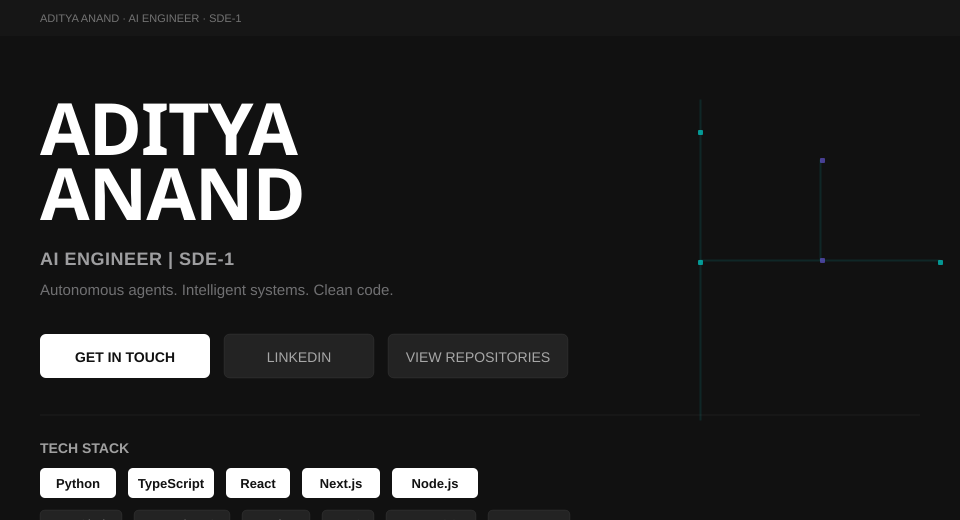

<!-- ═══════════════════════════════════════════════════════════════════
NIKE DESIGN SYSTEM — GitHub Profile README
Premium: boxy buttons (6px), subtle curves, clean accents
hero.svg loaded via  bypasses GitHub HTML sanitizer
═══════════════════════════════════════════════════════════════════ -->

 

<!-- CLICKABLE CTA PILLS -->

&nbsp;

&nbsp;

  

---

## CONTRIBUTION GAME

<picture>
  <source media="(prefers-color-scheme: dark)" srcset="https://raw.githubusercontent.com/adityaanand0001/adityaanand0001/output/snake-dark.svg">
  
</picture>

---

## ABOUT

> I build software where performance and design are inseparable.
> AI engineering, full-stack systems, and developer tooling —
> with an eye toward systems that feel as good to use as they are to maintain.
>
> **Based in India · Open to collaboration**

---

  

