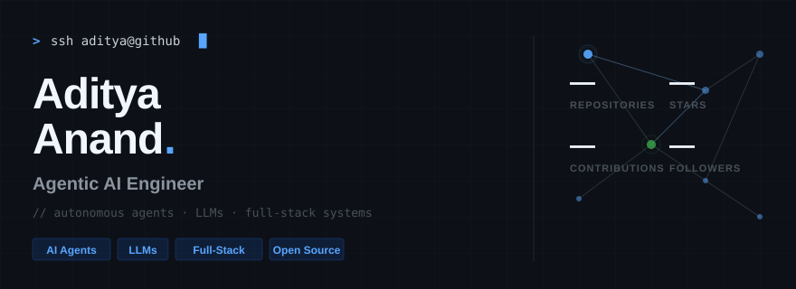

<div align="center">



<br>

<!-- SOCIALS -->
<a href="mailto:aditya.anand@monks.com">
  
</a>
&nbsp;
<a href="https://linkedin.com/in/adityaArise">
  
</a>
&nbsp;
<a href="https://github.com/adityaanand0001">
  
</a>
&nbsp;
<a href="#">
  
</a>

<br><br>

<!-- TECH STACK -->
<h3>⚡ TECH STACK</h3>

<p>
  
  
  
  
  
</p>

<p>
  
  
  
  
  
</p>

<p>
  
  
  
  
  
</p>

<br>

<!-- GITHUB STATS -->
<h3>📊 GITHUB STATS</h3>

<p>
  
  
</p>

<p>
  
</p>

<!-- ACTIVITY GRAPH -->
<h3>📈 CONTRIBUTION GRAPH</h3>

<picture>
  <source media="(prefers-color-scheme: dark)" srcset="https://github-readme-activity-graph.vercel.app/graph?username=adityaanand0001&theme=github-dark&hide_border=true&bg_color=0d1117&color=58a6ff&line=3fb950&point=58a6ff&area=true&area_color=58a6ff">
  
</picture>

<br><br>

<!-- TROPHIES -->
<picture>
  <source media="(prefers-color-scheme: dark)" srcset="https://github-profile-trophy.vercel.app/?username=adityaanand0001&theme=darkhub&no-frame=true&column=7&margin-w=8">
  
</picture>

<br>

<!-- SNAKE GAME -->
<h3>🐍 CONTRIBUTION SNAKE</h3>

<picture>
  <source media="(prefers-color-scheme: dark)" srcset="https://raw.githubusercontent.com/adityaanand0001/adityaanand0001/output/snake-dark.svg">
  
</picture>

<br>

<!-- ABOUT -->
<h3>🧠 ABOUT</h3>

<table><tr><td>

```
> whoami
adityaanand

> role
Agentic AI Engineer | SDE-1

> focus
Building autonomous agent systems, RAG pipelines,
and full-stack applications. I ship code that thinks.

> currently
🔭 Exploring multi-agent architectures
🌱 Learning distributed systems at scale
💡 Open to collaborating on open-source AI projects

> contact
📧 aditya.anand@monks.com
```

</td></tr></table>

<br>

<!-- VISITOR COUNT -->


<br>


</div>
