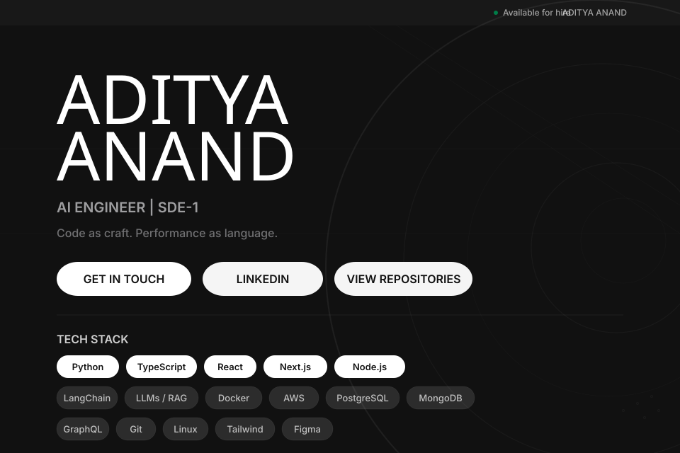

<!-- ═══════════════════════════════════════════════════════════════════
NIKE DESIGN SYSTEM — GitHub Profile README

Strategy: External SVGs (header.svg, etc.) loaded via  tags.
GitHub's sanitizer only touches *inline* SVG/HTML. External files
loaded as images bypass the sanitizer — <style> blocks, @import
for Google Fonts, full CSS all work.

Tokens:  ink #111111  |  canvas #ffffff  |  soft-cloud #f5f5f5
═══════════════════════════════════════════════════════════════════ -->

<!-- HERO — external SVG, full CSS including Bebas Neue + Inter via Google Fonts -->

  

<!-- CLICKABLE CTA PILLS (can't put links inside , so these sit below) -->

&nbsp;

&nbsp;

  

---

## TECH STACK

<!-- Primary — ink chips (active filter-chip pattern) -->

  
  
  
  
  

<!-- Secondary — soft-cloud chips (default filter-chip pattern) -->

  
  
  
  
  

  
  
  
  
  

---

## PERFORMANCE

 

---

## TROPHIES

---

## CONTRIBUTION GAME

<picture>
  <source media="(prefers-color-scheme: dark)" srcset="https://raw.githubusercontent.com/adityaanand0001/adityaanand0001/output/snake-dark.svg">
  
</picture>

---

## ABOUT

> I build software where performance and design are inseparable.
> Full-stack web applications, cloud infrastructure, and developer tooling —
> with an eye toward systems that feel as good to use as they are to maintain.
>
> **Based in India · Open to collaboration**

---

  

