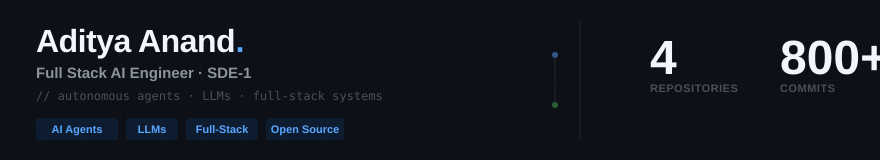
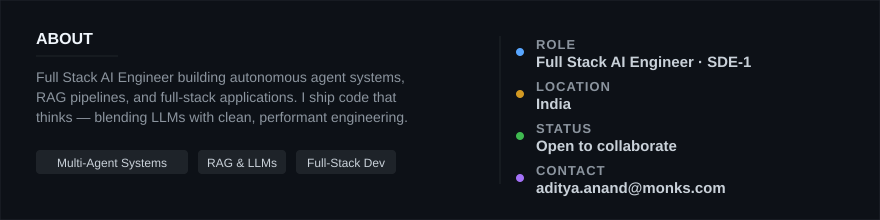

 

&nbsp;

&nbsp;

&nbsp;

&nbsp;

  

<h3>⚡ TECH STACK</h3>

  
  
  
  
  

  
  
  
  
  

  
  
  
  
  

 

<h3>📈 CONTRIBUTIONS</h3>

<picture>
  <source media="(prefers-color-scheme: dark)" srcset="https://github-readme-activity-graph.vercel.app/graph?username=adityaanand0001&theme=github-dark&hide_border=true&bg_color=0d1117&color=58a6ff&line=3fb950&point=58a6ff&area=true&area_color=58a6ff">
  
</picture>

 

  

<picture>
  
</picture>

 

<h3>🐍 SNAKE</h3>

<picture>
  <source media="(prefers-color-scheme: dark)" srcset="https://raw.githubusercontent.com/adityaanand0001/adityaanand0001/output/snake-dark.svg">
  
</picture>

 

<h3>🧠 ABOUT</h3>

 

